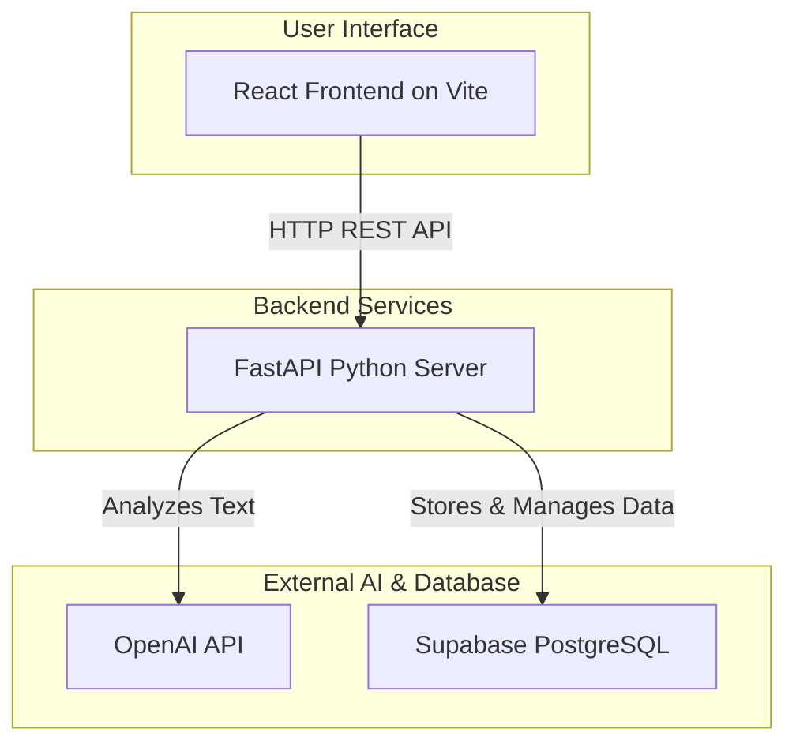
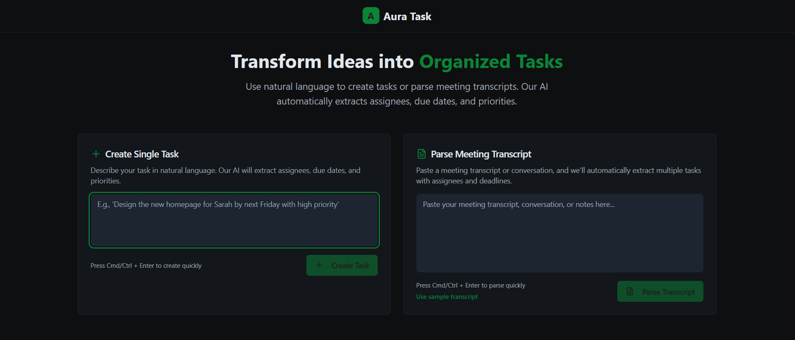
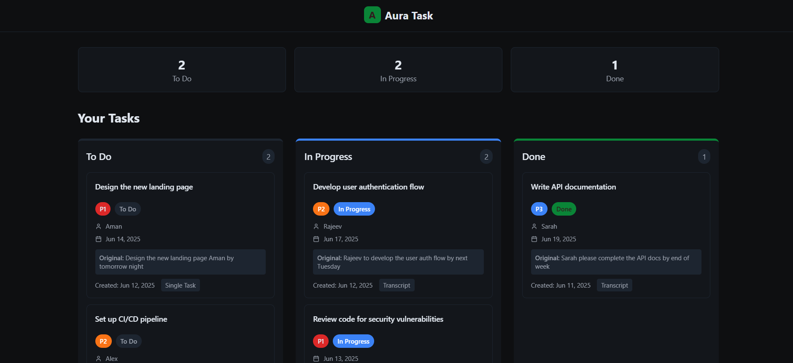
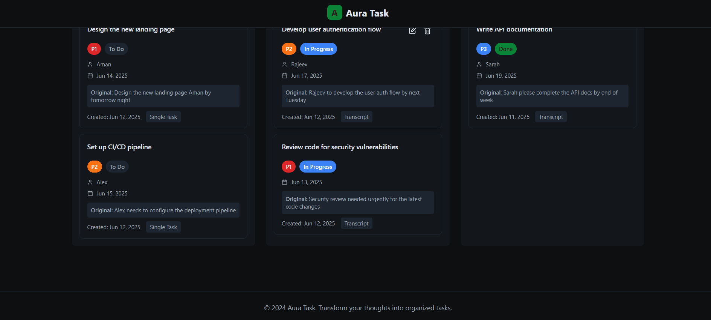

# Aura Task ✨

A smart to-do list application that intelligently parses tasks from natural language inputs and meeting transcripts using AI.

[](https://www.repostatus.org/#active)
[](https://opensource.org/licenses/MIT)

---

### 📺 Live Demo & Presentation

*<p align="center">**Live Application:** [**[Your Live Project URL Here]**](https://your-live-project-url-here.com)</p>*
*<p align="center">**Video Walkthrough:** [Your YouTube Video Link Here]</p>*

---

## Overview

Aura Task is a modern, full-stack application designed to streamline task management. Its core feature is the ability to understand plain English and automatically convert it into structured, actionable to-do items. Whether you're jotting down a quick reminder or pasting a full meeting transcript, Aura Task extracts the necessary details—what needs to be done, who needs to do it, and when it's due.

This project is built with a decoupled architecture, featuring a powerful FastAPI backend and a responsive React frontend.

For a complete technical breakdown of the project's vision, architecture, and API contract, please see the [**Aura Task Project Blueprint**](AuraTaskProject.md).

## Key Features

- **AI-Powered Task Parsing:** Leverages OpenAI's GPT models to understand natural language and create structured tasks.
- **Single Task Creation:** Quickly add a to-do item from a single sentence (e.g., "Remind Alex to finish the report by Friday").
- **Meeting Transcript Parsing:** Paste an entire conversation and automatically extract all action items.
- **Action-Oriented Validation:** A smart backend gate ensures that only truly actionable tasks (with a clear subject and a due date or assignee) are created.
- **Full CRUD Functionality:** Create, Read, Update, and Delete tasks through an intuitive UI.
- **Resilient Frontend:** The UI includes a fallback mechanism to use local mock data if the backend is unavailable, ensuring a smooth user experience.

## Architecture

The application uses a modern, service-oriented architecture. The frontend is completely decoupled from the backend, communicating via a REST API.



## Technology Stack

### Backend

- **Framework:** FastAPI
- **Database:** PostgreSQL (via Supabase)
- **AI / NLP:** OpenAI (`gpt-3.5-turbo` or higher)
- **Data Validation:** Pydantic V2
- **Database Client:** `supabase-py`
- **Environment Management:** `python-dotenv`, `pydantic-settings`

### Frontend

- **Framework:** React (with TypeScript)
- **Build Tool:** Vite
- **Styling:** Tailwind CSS

---

## 🚀 Getting Started: Local Setup

Follow these instructions to get the Aura Task application running on your local machine.

### Prerequisites

- **Node.js:** v18 or later
- **Python:** v3.11 or later
- **Supabase Account:** A free account is required for the database.
- **OpenAI Account:** An account with API access is required for the NLP features.

### 1. Backend Setup

First, configure and run the FastAPI server.

```bash
# 1. Clone the repository
git clone https://github.com/your-username/Aura-Task.git
cd Aura-Task/server

# 2. Create and activate a Python virtual environment
python -m venv venv
# On Windows:
# venv\Scripts\activate
# On macOS/Linux:
# source venv/bin/activate

# 3. Install dependencies
pip install -r requirements.txt

# 4. Set up your environment variables
# Create a new file named .env in the /server directory
# and add the following content:
```

#### `server/.env` File

```env
# ----------------------------------
# OpenAI API Configuration
# ----------------------------------
# Get your key from: https://platform.openai.com/api-keys
OPENAI_API_KEY="your_openai_api_key_here"

# ----------------------------------
# Supabase Project Credentials
# ----------------------------------
# Get your project URL and anon key from your Supabase project's API settings.
# Project URL -> Settings -> API -> Project URL
SUPABASE_URL="https://your-project-reference-id.supabase.co"

# Project API Key -> Settings -> API -> Project API Keys -> anon (public)
SUPABASE_KEY="your_supabase_anon_public_key_here"
```

#### 5. Set up the Supabase Database

In your Supabase project, navigate to the **SQL Editor** and run the following script to create the `tasks` table:

```sql
CREATE TABLE tasks (
    id UUID PRIMARY KEY DEFAULT gen_random_uuid(),
    task_name TEXT NOT NULL,
    assignee TEXT,
    due_date TIMESTAMPTZ,
    priority VARCHAR(2),
    status TEXT NOT NULL DEFAULT 'To Do',
    original_text TEXT,
    source TEXT,
    created_at TIMESTAMPTZ NOT NULL DEFAULT now(),
    user_id UUID -- Nullable for now, for future authentication
);

-- Enable Row Level Security (good practice)
ALTER TABLE tasks ENABLE ROW LEVEL SECURITY;

-- Create policies to allow users to manage their own tasks
-- For now, we'll allow anonymous access for the MVP
CREATE POLICY "Allow anon read access" ON tasks FOR SELECT TO anon USING (true);
CREATE POLICY "Allow anon insert access" ON tasks FOR INSERT TO anon WITH CHECK (true);
CREATE POLICY "Allow anon update access" ON tasks FOR UPDATE TO anon USING (true);
CREATE POLICY "Allow anon delete access" ON tasks FOR DELETE TO anon USING (true);
```

#### 6. Run the Backend Server

```bash
# From the /server directory
uvicorn main:app --reload
```

The backend API will be available at `http://localhost:8000`.

### 2. Frontend Setup

Now, run the React client in a separate terminal.

```bash
# 1. Navigate to the client directory
cd ../client

# 2. Install dependencies
# Using npm:
npm install
# Or using Bun:
# bun install

# 3. Run the development server
# Using npm:
npm run dev
# Or using Bun:
# bun dev
```

The frontend application will be available at `http://localhost:5173` (or another port if 5173 is busy). It is pre-configured to connect to your local backend server.

---

## 📸 Screenshots

<p align="center">
  
</p>

<br>

<p align="center">
  
</p>

<br>

<p align="center">
  
</p>


---

## ☁️ Deployment

This section can be updated with instructions for deploying the application to cloud services.

-   **Backend (FastAPI):** Can be deployed to services like Render, Heroku, or any VPS.
-   **Frontend (React):** Can be deployed to static hosting providers like Vercel, Netlify, or GitHub Pages.

---

## License

Distributed under the MIT License. See `LICENSE` for more information.
